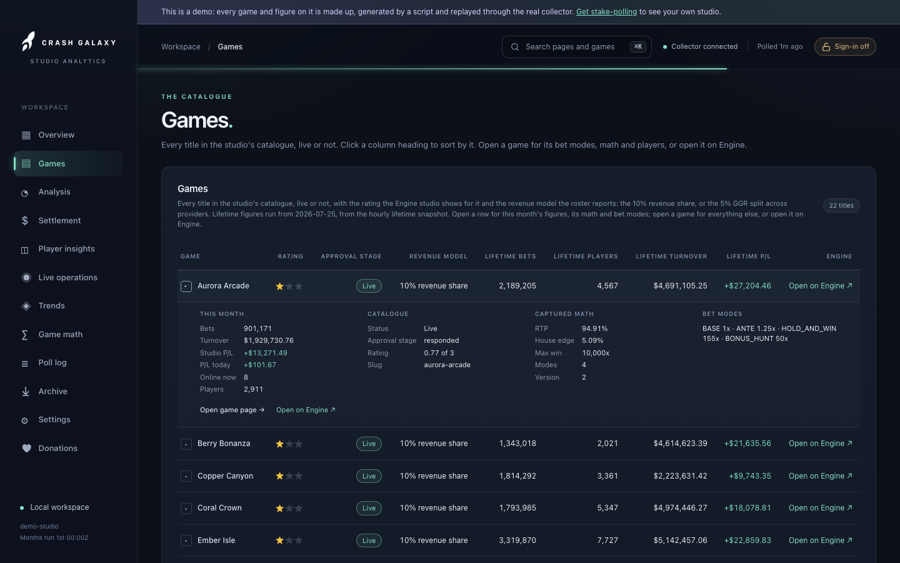

# Games

Route: `/games`

*From the demo: every game and figure is made up.*

The studio's catalogue, every title live or not, and the titles not yet live.
The [Overview](overview.md) is today in charts; this page is where every game
is listed.

## Games

| Column | Shows |
|---|---|
| ▸ | Opens the row's details (below) |
| Game | The title; opens its [game page](game.md) |
| Rating | The star rating the Engine studio shows for it, out of three (the catalogue's `rating` over 30, rounded), or *Unrated* |
| Approval stage | **Live** once the title is live; otherwise the stage as the catalogue reports it |
| Revenue model | From the roster's rate: the **10% revenue share** or the **5% GGR split across providers**. A dash for a title not on the roster - the API reports a rate only for a game with figures |
| Lifetime bets, players, turnover, P/L | Since `lifetimeStart`, from the hourly lifetime snapshot (see [configuration](../configuration.md)). P/L is the studio's share. A dash for a title the snapshot does not list - never a zero |
| Engine | Opens the title's page on the Engine studio, in a new tab |

Live titles come first, then the dark ones, each run by name.

### Details

The ▸ button opens a row beneath the title: this month's bets, turnover,
studio P/L, P/L today, players online and players; the catalogue facts
(status - *Live*, *Not live*, *Published · not live* or *Unpublished* - the
approval stage, the rating out of three, the slug); the captured math (RTP,
house edge, max win, modes, version) or a note that none was captured; the bet
modes with their cost, from the per-mode read or, before one, the captured
math; and the links to the game page and to Engine. An open row stays open
through the live refresh and moves with its title when the table is sorted.

## Not yet live

Titles in the catalogue but not turned on. The API reports no play for them at
all, so this table carries what is known - status, approval stage, and the
captured math (RTP, number of modes, max win) - and no money columns. A row of
$0.00 would claim somebody watched a quiet month.

## Sorting

Click a column heading to sort by it, and again to reverse. Numbers start
biggest first, text A to Z; a figure nobody measured sorts last either way.
The choice is remembered for the tab, so it survives the live refresh.
