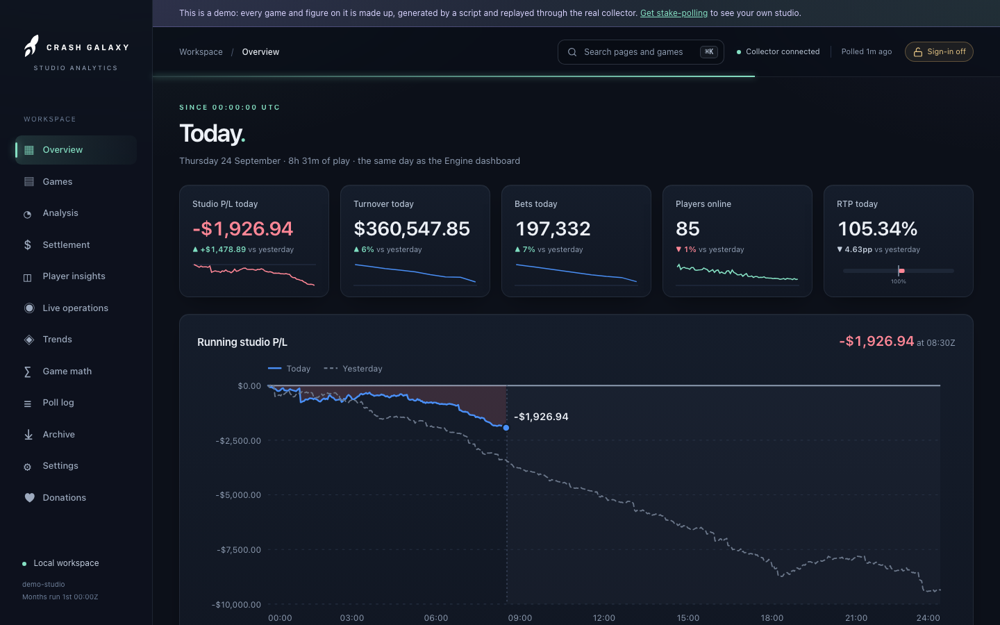

# Overview

Route: `/`

*From the demo: every game and figure is made up.*

The landing page is **today**, drawn rather than tabulated. Today means since
**00:00:00 UTC**, the same day the Engine studio dashboard reports, so the two
can be read side by side. It is pinned to midnight UTC whatever
[`dayBoundaryUtcHour`](../configuration.md#the-accounting-day) says.

Every chart is built from the collector's own trail and refreshes with each
poll. A stretch the collector missed is left empty, never drawn as zero, and
the hours still to come are shaded.

## KPI tiles

| Tile | Shows | Compared with |
|---|---|---|
| Studio P/L today | The studio's share of gross gaming revenue since 00:00Z, with a sparkline of the day | Dollars up or down on the same hours of yesterday |
| Turnover today | Since 00:00Z, with turnover per hour | Percent on the same hours of yesterday |
| Bets today | Since 00:00Z, with bets per hour | Percent on the same hours of yesterday |
| Players online | At the last poll, with the day's line | The reading nearest this time yesterday |
| RTP today | Gross, `1 - profit / turnover`, on a bar against the 100% break-even | Points on the same hours of yesterday, drawn neutral - RTP is luck, not a result |

The comparison needs the trail to reach yesterday's midnight; without it the
tile says *no yesterday to compare* rather than inventing a change. Studio-wide
figures come off the team trail through the same replica-lag filter as the
[Settlement](settlement.md) page, so its *today so far* and this page agree.

## Running studio P/L

The day's running studio P/L on a fixed 00:00-24:00 axis, so where the line
stops is how far through the day it is. Above zero is shaded green, below red.
Yesterday's whole day runs behind it as a dashed line. Hover for any quarter
hour's figures, today's and yesterday's.

## Turnover by hour, and Studio P/L by hour

The 24 clock hours of the day. Turnover is stacked by game in the same colours
as the share donut: the seven games with the largest share take a colour of
their own, the rest are *Other*. P/L per hour stands either side of a zero
line. The hour still filling says so in its readout.

## Turnover by game and hour

Every game that has taken a bet today against the 24 hours, each cell shaded
by that hour's turnover on a square-root scale (so a quiet game still shows
against a busy one). Hover a cell for its turnover, bets and studio P/L. A
dashed outline is an hour the collector missed; a blank cell is one that has
not happened yet, or came before the game joined the roster. Each game's name
opens its [game page](game.md).

## Studio P/L by game, and Share of turnover

Today's studio P/L per game, biggest winner first, and each game's share of
today's turnover.

## Players online

Players online at each poll since 00:00Z, with yesterday's day behind it.

## This month

One strip at the foot: studio P/L, turnover and bets month to date, and a link
to the [Games](games.md) page, which carries the catalogue and the titles not
yet live. Per-game month figures are on [Live operations](live.md) and in each
title's row on the Games page.
